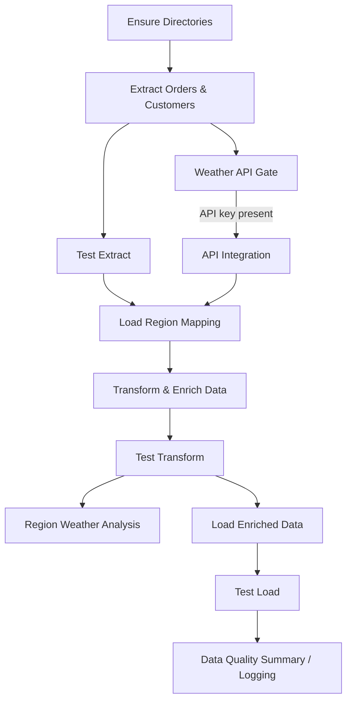

# Northwind Weather ETL Project

This project demonstrates an ETL pipeline combining Northwind SQLite data with OpenWeather enrichment and regional mapping. The pipeline is orchestrated using **Apache Airflow** and includes Python-based unit tests with **pytest**.

---

## Project Structure

```
├── dags/ # Airflow DAGs
├── etl/ # ETL modules (extract, transform, load, analysis)
├── tests/ # Unit tests for ETL steps
├── data/ # Raw and intermediate data
├── output/ # Output CSVs and data quality report
├── config/ # Config files
├── docker/ # Dockerfile & scripts
├── .env # Environment variables
└── docker-compose.yml
```

---

## Prerequisites

- Docker & Docker Compose installed
- Python 3.12 (for local tests outside Docker)
- Optional: `sudo` access for folder ownership

---

## Environment Setup

Clone the Github repo and CD into it, ensuring the MAKEFILE is visible when using ls.

Execute **`'make up'`** command from your bash terminal, this will do the following:
- Creates a .env file in the project root
    - Prompts you to add your Openweather api key - you can use yours or use the one received via secure sharing
    - Creates airflow user ids
- Prepares Folders
- Sets proper ownership and permissions once:
- Builds & Runs Docker

Airflow webserver: http://localhost:8080
DAG: northwind_weather_etl

## ETL Pipeline Tasks

### Data Extraction

- Extract Orders and Customers from Northwind SQLite.

### API Integration

- Enrich customer cities with weather data from OpenWeather API.

### Region Mapping Integration

- Load region_mapping.xlsx and join region info to enriched customer data.

### Data Quality Checks

- Schema validation: source tables & enriched dataset.
- Data validation: null checks, duplicates, mapping coverage.
- Logs inconsistencies to output/data_quality_report.log.

### Data Loading

- Load enriched customer dataset and region mapping table into SQLite.

### Orchestration

- Managed with Airflow DAG.
- Tasks have clear dependencies, logging, and optional scheduling.

### Dockerization

- Containerized environment with all dependencies.
- Runs the orchestrated ETL automatically.

## Tools & Libraries

- Pandas: Data manipulation
- SQLite3: Target database
- Requests / Python API: OpenWeather integration
- Pytest: Unit tests & data quality logging
- Apache Airflow: Orchestration

## Running Tests & Data Quality Reports

- Extract tests: pytest tests/test_extract.py
- Transform tests: pytest tests/test_transform.py
- Load tests: pytest tests/test_load.py
- Data Quality Summary: output/data_quality_report.log
- All tests also run automatically in DAG via BashOperator.

## Sample Output

- Enriched CSV: output/enriched_customers.csv
- Regional Weather Summary: output/region_weather_summary.csv
- Data Quality Log: output/data_quality_report.log

## Notes / Best Practices

- Mounted volumes ensure Airflow tasks can read/write data without permission issues.
- Static UID/GID ensures consistent file ownership across hosts.
- DAG tasks are modular: extract, enrich, map, validate, load, analyze.
- Clear logging and DQ checks ensure traceability and correctness.
- API key in .env (must be added), not tracked in Git to avoid leakage
- Modularity with central config file and component-oriented folder structure

## ETL Workflow Diagram

